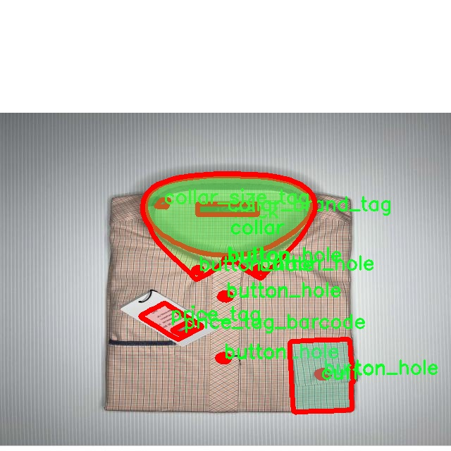

# 衬衫组件图像分割系统： yolov8-seg-C2f-EMBC

### 1.研究背景与意义

[参考博客](https://gitee.com/YOLOv8_YOLOv11_Segmentation_Studio/projects)

[博客来源](https://kdocs.cn/l/cszuIiCKVNis)

研究背景与意义

随着计算机视觉技术的快速发展，图像分割作为其重要的研究方向之一，逐渐引起了学术界和工业界的广泛关注。尤其是在服装行业，准确的图像分割技术能够显著提升产品识别、分类和推荐的效率，从而为消费者提供更为个性化的购物体验。衬衫作为服装市场中一种常见且需求量大的商品，其组件的精准识别与分割不仅对库存管理、产品展示和销售策略的制定具有重要意义，也为后续的智能穿戴设备、虚拟试衣间等应用奠定了基础。

在这一背景下，YOLO（You Only Look Once）系列模型因其高效的实时检测能力而受到广泛应用。YOLOv8作为该系列的最新版本，进一步提升了检测精度和速度，适用于多种复杂场景。然而，传统的YOLOv8模型在处理细粒度的图像分割任务时，仍存在一定的局限性，尤其是在衬衫组件的细节分割上。因此，基于改进YOLOv8的衬衫组件图像分割系统的研究显得尤为重要。

本研究所使用的数据集“Shirt Segmentation - 2”包含3500张图像，涵盖了12个不同的衬衫组件类别，包括纽扣、领子、品牌标签、尺码标签、袖口、颈部、价格标签及其条形码等。这些类别的多样性为模型的训练提供了丰富的样本，能够有效提升模型的泛化能力和识别精度。通过对这些组件的精准分割，不仅可以实现对衬衫整体外观的分析，还能够为后续的产品定价、市场分析等提供数据支持。

在技术上，改进YOLOv8模型的核心在于如何更好地处理图像中的细节信息。针对衬衫组件的特征，我们将引入多尺度特征融合、注意力机制等先进技术，以提升模型对小目标和复杂背景的适应能力。此外，针对数据集中的不同类别，我们将采用类别平衡的策略，确保模型在训练过程中对各个组件的学习均衡，从而避免出现偏差。

本研究的意义不仅在于提升衬衫组件的图像分割精度，更在于为服装行业的智能化发展提供技术支持。通过构建高效的图像分割系统，能够帮助商家更好地管理库存、优化产品展示、提升用户体验，进而推动服装行业的数字化转型。此外，该系统的成功应用还可以为其他服装类别的图像分割提供借鉴，具有广泛的推广价值。

综上所述，基于改进YOLOv8的衬衫组件图像分割系统的研究，不仅具有重要的学术价值，也为实际应用提供了切实可行的解决方案。随着研究的深入，期待能够在图像分割领域取得更为显著的成果，为服装行业的智能化发展贡献力量。

### 2.图片演示


注意：本项目提供完整的训练源码数据集和训练教程,由于此博客编辑较早,暂不提供权重文件（best.pt）,需要按照6.训练教程进行训练后实现上图效果。

### 3.视频演示

[3.1 视频演示](https://www.bilibili.com/video/BV1EjzXYnECu/)

### 4.数据集信息

##### 4.1 数据集类别数＆类别名

nc: 9
names: ['button', 'button_hole', 'collar', 'collar_brand_tag', 'collar_size_tag', 'cuff', 'neck', 'price_tag', 'price_tag_barcode']


##### 4.2 数据集信息简介

数据集信息展示

在本研究中，我们采用了名为“Shirt Segmentation - 2”的数据集，以训练和改进YOLOv8-seg模型，旨在实现衬衫组件的高效图像分割。该数据集包含了丰富的图像样本，专注于衬衫的多个关键组件，为模型的训练提供了多样化的视觉信息和特征。数据集的类别数量为9，涵盖了衬衫的不同组成部分，包括按钮、按钮孔、领子、领子品牌标签、领子尺码标签、袖口、颈部、价格标签以及价格标签条形码。这些类别的选择不仅反映了衬衫的基本构造，还考虑到了市场营销和产品识别的需求。

首先，按钮和按钮孔是衬衫的重要功能性组件，通常用于衬衫的闭合和装饰。数据集中包含的按钮图像展示了不同形状、颜色和材质的按钮样式，而按钮孔则提供了与之匹配的视觉信息，确保模型能够准确识别和分割这些组件。其次，领子作为衬衫的一个显著特征，其设计和风格各异，因此在数据集中，领子的图像样本展示了多种领型，包括翻领、立领等。这些样本不仅帮助模型学习领子的形状特征，还使其能够在实际应用中更好地适应不同款式的衬衫。

此外，领子品牌标签和尺码标签是现代服装中不可或缺的元素，提供了品牌信息和尺码指引。数据集中包含的这些标签图像，帮助模型理解和分割标签区域，从而在后续的应用中实现对品牌和尺码的自动识别。袖口和颈部作为衬衫的边缘部分，通常在设计上具有独特的风格，数据集中的样本确保模型能够捕捉到这些细节，提升分割的精确度。

价格标签和价格标签条形码则是与商品销售直接相关的组件。价格标签不仅包含价格信息，还可能包含促销信息，而条形码则是现代零售中不可或缺的元素。数据集中提供的这些图像样本，使得模型在分割时能够识别出这些信息，从而为后续的自动化库存管理和销售分析提供支持。

总的来说，“Shirt Segmentation - 2”数据集通过涵盖衬衫的多个重要组件，为YOLOv8-seg模型的训练提供了全面的基础。每个类别的样本不仅数量充足，而且在视觉上具有多样性，这为模型的学习提供了丰富的特征和上下文信息。通过对这些组件的有效分割，模型能够在实际应用中实现更高的准确性和效率，推动衬衫图像处理技术的发展。未来，我们期待通过对该数据集的深入研究和应用，进一步提升图像分割技术在服装行业中的实际价值，助力智能零售和自动化管理的实现。





### 5.项目依赖环境部署教程（零基础手把手教学）

[5.1 环境部署教程链接（零基础手把手教学）](https://www.bilibili.com/video/BV1jG4Ve4E9t/?vd_source=bc9aec86d164b67a7004b996143742dc)


[5.2 安装Python虚拟环境创建和依赖库安装视频教程链接（零基础手把手教学）](https://www.bilibili.com/video/BV1nA4VeYEze/?vd_source=bc9aec86d164b67a7004b996143742dc)

### 6.手把手YOLOV8-seg训练视频教程（零基础手把手教学）

[6.1 手把手YOLOV8-seg训练视频教程（零基础小白有手就能学会）](https://www.bilibili.com/video/BV1cA4VeYETe/?vd_source=bc9aec86d164b67a7004b996143742dc)


按照上面的训练视频教程链接加载项目提供的数据集，运行train.py即可开始训练



     Epoch   gpu_mem       box       obj       cls    labels  img_size
     1/200     0G   0.01576   0.01955  0.007536        22      1280: 100%|██████████| 849/849 [14:42<00:00,  1.04s/it]
               Class     Images     Labels          P          R     mAP@.5 mAP@.5:.95: 100%|██████████| 213/213 [01:14<00:00,  2.87it/s]
                 all       3395      17314      0.994      0.957      0.0957      0.0843

     Epoch   gpu_mem       box       obj       cls    labels  img_size
     2/200     0G   0.01578   0.01923  0.007006        22      1280: 100%|██████████| 849/849 [14:44<00:00,  1.04s/it]
               Class     Images     Labels          P          R     mAP@.5 mAP@.5:.95: 100%|██████████| 213/213 [01:12<00:00,  2.95it/s]
                 all       3395      17314      0.996      0.956      0.0957      0.0845

     Epoch   gpu_mem       box       obj       cls    labels  img_size
     3/200     0G   0.01561    0.0191  0.006895        27      1280: 100%|██████████| 849/849 [10:56<00:00,  1.29it/s]
               Class     Images     Labels          P          R     mAP@.5 mAP@.5:.95: 100%|███████   | 187/213 [00:52<00:00,  4.04it/s]
                 all       3395      17314      0.996      0.957      0.0957      0.0845


### 7.50+种全套YOLOV8-seg创新点加载调参实验视频教程（一键加载写好的改进模型的配置文件）

[7.1 50+种全套YOLOV8-seg创新点加载调参实验视频教程（一键加载写好的改进模型的配置文件）](https://www.bilibili.com/video/BV1Hw4VePEXv/?vd_source=bc9aec86d164b67a7004b996143742dc)

### YOLOV8-seg算法简介

原始YOLOv8-seg算法原理

YOLOv8-seg算法作为YOLO系列的最新发展，承载着目标检测和图像分割的双重任务，其设计理念和实现方法在继承YOLOv5和YOLOv7的基础上进行了创新和优化。YOLOv8-seg算法的架构主要由输入层、主干网络、特征融合层和解耦头组成，整体结构的设计旨在提升目标检测的精度和效率，同时实现对图像的精细分割。

在YOLOv8-seg的主干网络中，采用了CSPDarknet的思想，核心模块C2f的引入是其一大亮点。C2f模块不仅延续了YOLOv5的C3模块的基本结构，还结合了YOLOv7的ELAN思想，形成了一个更为高效的特征提取单元。C2f模块通过增加多个shortcut连接，缓解了深层网络中的梯度消失问题，增强了浅层特征的重用能力。这一设计使得网络在保持轻量化的同时，能够提取到更加丰富的特征信息。具体而言，C2f模块由多个CBS（卷积+归一化+SiLU激活）模块和Bottleneck结构组成，通过特征的分支和重组，有效提升了网络的表达能力。

在特征融合层，YOLOv8-seg采用了PAN-FPN结构，这一结构能够实现多尺度特征的深度融合，充分利用来自不同层次的特征信息。特征融合的过程分为自下而上的融合和自上而下的连接，确保了高层特征的语义信息与低层特征的细节信息能够有效结合。这种设计不仅提升了模型对不同尺度目标的检测能力，也增强了模型的鲁棒性。

YOLOv8-seg的另一个重要创新在于其解耦头的设计。与传统的Anchor-Based方法不同，YOLOv8-seg采用了Anchor-Free的策略，解耦了分类和回归任务。这一设计使得模型在处理复杂场景时能够更为灵活，减少了对预定义锚框的依赖，从而提高了检测的准确性和效率。在Head部分，YOLOv8-seg通过三个不同尺度的特征图进行目标的分类和边框回归，利用分离的分类和回归分支，优化了目标检测的过程。

损失函数的设计也是YOLOv8-seg的一大亮点。该算法采用了VFLLoss作为分类损失，DFLLoss和CIoULoss作为回归损失，这种组合能够有效解决样本不平衡的问题，提升模型的学习效果。特别是在处理小目标时，Focal Loss的引入使得模型能够更加关注难以分类的样本，从而提升整体的检测精度。

在数据预处理阶段，YOLOv8-seg沿用了YOLOv5的策略，采用了多种数据增强手段，如马赛克增强、混合增强、空间扰动和颜色扰动等。这些增强方法的应用不仅丰富了训练样本的多样性，也提高了模型的泛化能力。值得注意的是，YOLOv8-seg在训练的最后阶段关闭了马赛克增强，以进一步提升模型的稳定性和收敛速度。

综上所述，YOLOv8-seg算法通过引入C2f模块、PAN-FPN结构、Anchor-Free解耦头以及创新的损失函数设计，构建了一个高效且精确的目标检测与图像分割框架。其在多尺度特征融合、样本匹配策略和数据增强等方面的创新，极大地提升了模型的性能，使其在复杂场景下依然能够保持良好的检测效果。随着YOLOv8-seg的不断发展和应用，未来在目标检测和图像分割领域的潜力将更加广阔。


### 9.系统功能展示（检测对象为举例，实际内容以本项目数据集为准）

图9.1.系统支持检测结果表格显示

  图9.2.系统支持置信度和IOU阈值手动调节

  图9.3.系统支持自定义加载权重文件best.pt(需要你通过步骤5中训练获得)

  图9.4.系统支持摄像头实时识别

  图9.5.系统支持图片识别

  图9.6.系统支持视频识别

  图9.7.系统支持识别结果文件自动保存

  图9.8.系统支持Excel导出检测结果数据


### 10.50+种全套YOLOV8-seg创新点原理讲解（非科班也可以轻松写刊发刊，V11版本正在科研待更新）

#### 10.1 由于篇幅限制，每个创新点的具体原理讲解就不一一展开，具体见下列网址中的创新点对应子项目的技术原理博客网址【Blog】：


[10.1 50+种全套YOLOV8-seg创新点原理讲解链接](https://gitee.com/qunmasj/good)

#### 10.2 部分改进模块原理讲解(完整的改进原理见上图和技术博客链接)【如果此小节的图加载失败可以通过CSDN或者Github搜索该博客的标题访问原始博客，原始博客图片显示正常】

### Gold-YOLO简介
YOLO再升级：华为诺亚提出Gold-YOLO，聚集-分发机制打造新SOTA
在过去的几年中，YOLO系列模型已经成为实时目标检测领域的领先方法。许多研究通过修改架构、增加数据和设计新的损失函数，将基线推向了更高的水平。然而以前的模型仍然存在信息融合问题，尽管特征金字塔网络（FPN）和路径聚合网络（PANet）已经在一定程度上缓解了这个问题。因此，本研究提出了一种先进的聚集和分发机制（GD机制），该机制通过卷积和自注意力操作实现。这种新设计的模型被称为Gold-YOLO，它提升了多尺度特征融合能力，在所有模型尺度上实现了延迟和准确性的理想平衡。此外，本文首次在YOLO系列中实现了MAE风格的预训练，使得YOLO系列模型能够从无监督预训练中受益。Gold-YOLO-N在COCO val2017数据集上实现了出色的39.9% AP，并在T4 GPU上实现了1030 FPS，超过了之前的SOTA模型YOLOv6-3.0-N，其FPS相似，但性能提升了2.4%。


#### Gold-YOLO


YOLO系列的中间层结构采用了传统的FPN结构，其中包含多个分支用于多尺度特征融合。然而，它只充分融合来自相邻级别的特征，对于其他层次的信息只能间接地进行“递归”获取。

传统的FPN结构在信息传输过程中存在丢失大量信息的问题。这是因为层之间的信息交互仅限于中间层选择的信息，未被选择的信息在传输过程中被丢弃。这种情况导致某个Level的信息只能充分辅助相邻层，而对其他全局层的帮助较弱。因此，整体上信息融合的有效性可能受到限制。
为了避免在传输过程中丢失信息，本文采用了一种新颖的“聚集和分发”机制（GD），放弃了原始的递归方法。该机制使用一个统一的模块来收集和融合所有Level的信息，并将其分发到不同的Level。通过这种方式，作者不仅避免了传统FPN结构固有的信息丢失问题，还增强了中间层的部分信息融合能力，而且并没有显著增加延迟。


# 8.低阶聚合和分发分支 Low-stage gather-and-distribute branch
从主干网络中选择输出的B2、B3、B4、B5特征进行融合，以获取保留小目标信息的高分辨率特征。


低阶特征对齐模块 (Low-stage feature alignment module)： 在低阶特征对齐模块（Low-FAM）中，采用平均池化（AvgPool）操作对输入特征进行下采样，以实现统一的大小。通过将特征调整为组中最小的特征大小（ R B 4 = 1 / 4 R ） （R_{B4} = 1/4R）（R 
B4 =1/4R），我们得到对齐后的特征F a l i g n F_{align}F align 。低阶特征对齐技术确保了信息的高效聚合，同时通过变换器模块来最小化后续处理的计算复杂性。其中选择 R B 4 R_{B4}R B4 作为特征对齐的目标大小主要基于保留更多的低层信息的同时不会带来较大的计算延迟。
低阶信息融合模块(Low-stage information fusion module)： 低阶信息融合模块（Low-IFM）设计包括多层重新参数化卷积块（RepBlock）和分裂操作。具体而言，RepBlock以F a l i g n ( c h a n n e l = s u m ( C B 2 ， C B 3 ， C B 4 ， C B 5 ) ) F_{align} (channel= sum(C_{B2}，C_{B3}，C_{B4}，C_{B5}))F align (channel=sum(C B2 ，C B3 ，C B4 ，C B5 )作为输入，并生成F f u s e ( c h a n n e l = C B 4 + C B 5 ) F_{fuse} (channel= C_{B4} + C_{B5})F fuse (channel=C B4 +C B5 )。其中中间通道是一个可调整的值（例如256），以适应不同的模型大小。由RepBlock生成的特征随后在通道维度上分裂为F i n j P 3 Finj_P3Finj P 3和F i n j P 4 Finj_P4Finj P 4，然后与不同级别的特征进行融合。


# 8.高阶聚合和分发分支 High-stage gather-and-distribute branch
高级全局特征对齐模块（High-GD）将由低级全局特征对齐模块（Low-GD）生成的特征{P3, P4, P5}进行融合。


高级特征对齐模块(High-stage feature alignment module)： High-FAM由avgpool组成，用于将输入特征的维度减小到统一的尺寸。具体而言，当输入特征的尺寸为{R P 3 R_{P3}R P3 , R P 4 R_{P4}R P4 , R P 5 R_{P 5}R P5 }时，avgpool将特征尺寸减小到该特征组中最小的尺寸（R P 5 R_{P5}R P5  = 1/8R）。由于transformer模块提取了高层次的信息，池化操作有助于信息聚合，同时降低了transformer模块后续步骤的计算需求。

Transformer融合模块由多个堆叠的transformer组成，transformer块的数量为L。每个transformer块包括一个多头注意力块、一个前馈网络（FFN）和残差连接。采用与LeViT相同的设置来配置多头注意力块，使用16个通道作为键K和查询Q的头维度，32个通道作为值V的头维度。为了加速推理过程，将层归一化操作替换为批归一化，并将所有的GELU激活函数替换为ReLU。为了增强变换器块的局部连接，在两个1x1卷积层之间添加了一个深度卷积层。同时，将FFN的扩展因子设置为2，以在速度和计算成本之间取得平衡。

信息注入模块(Information injection module)： 高级全局特征对齐模块（High-GD）中的信息注入模块与低级全局特征对齐模块（Low-GD）中的相同。在高级阶段，局部特征（Flocal）等于Pi，因此公式如下所示：


### 增强的跨层信息流动 Enhanced cross-layer information flow
为了进一步提升性能，从YOLOv8 中的PAFPN模块中得到启发，引入了Inject-LAF模块。该模块是注入模块的增强版，包括了一个轻量级相邻层融合（LAF）模块，该模块被添加到注入模块的输入位置。为了在速度和准确性之间取得平衡，设计了两个LAF模型：LAF低级模型和LAF高级模型，分别用于低级注入（合并相邻两层的特征）和高级注入（合并相邻一层的特征）。它们的结构如图5(b)所示。为了确保来自不同层级的特征图与目标大小对齐，在实现中的两个LAF模型仅使用了三个操作符：双线性插值（上采样过小的特征）、平均池化（下采样过大的特征）和1x1卷积（调整与目标通道不同的特征）。模型中的LAF模块与信息注入模块的结合有效地平衡了准确性和速度之间的关系。通过使用简化的操作，能够增加不同层级之间的信息流路径数量，从而提高性能而不显著增加延迟。


### 11.项目核心源码讲解（再也不用担心看不懂代码逻辑）

#### 11.1 ultralytics\models\yolo\pose\__init__.py

以下是对给定代码的逐文件分析和核心部分的保留，并添加详细的中文注释：

```python
# Ultralytics YOLO 🚀, AGPL-3.0 license

# 从当前包中导入PosePredictor、PoseTrainer和PoseValidator类
from .predict import PosePredictor  # 导入姿态预测器
from .train import PoseTrainer      # 导入姿态训练器
from .val import PoseValidator       # 导入姿态验证器

# 定义模块的公共接口，允许从此模块导入的类
__all__ = 'PoseTrainer', 'PoseValidator', 'PosePredictor'
```

### 代码分析：
1. **导入模块**：
   - `from .predict import PosePredictor`：从当前包的`predict`模块中导入`PosePredictor`类，负责姿态预测的功能。
   - `from .train import PoseTrainer`：从当前包的`train`模块中导入`PoseTrainer`类，负责模型的训练过程。
   - `from .val import PoseValidator`：从当前包的`val`模块中导入`PoseValidator`类，负责模型的验证和评估。

2. **`__all__` 变量**：
   - `__all__`是一个特殊变量，用于定义当使用`from module import *`时，哪些名称会被导入。这里定义了三个类：`PoseTrainer`、`PoseValidator`和`PosePredictor`，表示这些类是该模块的公共接口。

### 核心部分：
保留了导入和`__all__`的定义，因为它们是模块功能的核心，确保其他模块可以正确使用这些类。

这个文件是Ultralytics YOLO项目中的一个初始化文件，通常用于定义模块的公共接口。在这个特定的文件中，主要涉及到姿态估计（Pose Estimation）相关的功能。

首先，文件开头的注释表明该项目使用的是AGPL-3.0许可证，这是一种开源许可证，允许用户自由使用、修改和分发软件，但要求在分发时也要开放源代码。

接下来，文件通过相对导入的方式引入了三个类：`PosePredictor`、`PoseTrainer`和`PoseValidator`。这些类分别负责姿态预测、模型训练和模型验证的功能。具体来说：

- `PosePredictor`类用于进行姿态预测，它可能包含一些方法来处理输入数据并输出姿态估计的结果。
- `PoseTrainer`类负责训练姿态估计模型，可能包括数据加载、模型构建、损失计算和优化等步骤。
- `PoseValidator`类用于验证训练好的模型的性能，通常会评估模型在验证集上的表现，以确保模型的泛化能力。

最后，`__all__`变量定义了该模块的公共接口，表明在使用`from module import *`语句时，只会导入`PoseTrainer`、`PoseValidator`和`PosePredictor`这三个类。这种做法有助于控制模块的可见性，避免不必要的内部实现细节被暴露给用户。

总体而言，这个初始化文件为姿态估计模块提供了一个清晰的结构，方便用户在其他地方使用这些功能。

#### 11.2 ultralytics\trackers\basetrack.py

以下是代码中最核心的部分，并附上详细的中文注释：

```python
from collections import OrderedDict
import numpy as np

class TrackState:
    """跟踪状态的枚举类，表示可能的物体跟踪状态。"""
    New = 0      # 新建状态
    Tracked = 1  # 正在跟踪状态
    Lost = 2     # 丢失状态
    Removed = 3  # 被移除状态

class BaseTrack:
    """物体跟踪的基类，处理基本的跟踪属性和操作。"""

    _count = 0  # 全局跟踪ID计数器

    track_id = 0  # 当前跟踪的ID
    is_activated = False  # 跟踪是否被激活
    state = TrackState.New  # 跟踪的初始状态

    history = OrderedDict()  # 存储跟踪历史的有序字典
    features = []  # 特征列表
    curr_feature = None  # 当前特征
    score = 0  # 跟踪得分
    start_frame = 0  # 跟踪开始的帧
    frame_id = 0  # 当前帧ID
    time_since_update = 0  # 自上次更新以来的时间

    # 多摄像头支持
    location = (np.inf, np.inf)  # 跟踪对象的位置，初始化为无穷大

    @property
    def end_frame(self):
        """返回跟踪的最后帧ID。"""
        return self.frame_id

    @staticmethod
    def next_id():
        """递增并返回全局跟踪ID计数器。"""
        BaseTrack._count += 1
        return BaseTrack._count

    def activate(self, *args):
        """激活跟踪，使用提供的参数。"""
        raise NotImplementedError  # 该方法需要在子类中实现

    def predict(self):
        """预测跟踪的下一个状态。"""
        raise NotImplementedError  # 该方法需要在子类中实现

    def update(self, *args, **kwargs):
        """使用新的观测值更新跟踪。"""
        raise NotImplementedError  # 该方法需要在子类中实现

    def mark_lost(self):
        """将跟踪标记为丢失。"""
        self.state = TrackState.Lost

    def mark_removed(self):
        """将跟踪标记为移除。"""
        self.state = TrackState.Removed

    @staticmethod
    def reset_id():
        """重置全局跟踪ID计数器。"""
        BaseTrack._count = 0
```

### 代码核心部分说明：
1. **TrackState类**：定义了物体跟踪的不同状态，便于在跟踪过程中管理和判断对象的状态。
2. **BaseTrack类**：作为物体跟踪的基类，包含了跟踪的基本属性（如ID、状态、历史记录等）和方法（如激活、预测、更新等），为具体的跟踪实现提供了基础。
3. **静态方法**：`next_id`和`reset_id`用于管理全局跟踪ID，确保每个跟踪对象都有唯一的标识符。
4. **状态管理**：通过`mark_lost`和`mark_removed`方法，能够灵活地更新跟踪对象的状态。

这个程序文件是一个用于对象跟踪的基础类，属于Ultralytics YOLO项目的一部分。文件中定义了一个跟踪状态的枚举类`TrackState`，其中包含四种状态：新建（New）、跟踪中（Tracked）、丢失（Lost）和已移除（Removed）。这些状态用于表示跟踪对象在不同时间点的状态。

接下来，定义了一个名为`BaseTrack`的类，它是对象跟踪的基类，负责处理基本的跟踪属性和操作。该类中有一个类变量`_count`，用于跟踪全局的跟踪ID计数器。每个跟踪对象都有一个唯一的`track_id`，以及一个布尔值`is_activated`，表示该跟踪是否被激活。`state`属性用于存储当前的跟踪状态，默认为新建状态。

`BaseTrack`类还包含了一些用于跟踪的属性，如`history`（使用有序字典存储历史信息）、`features`（存储特征信息）、`curr_feature`（当前特征）、`score`（跟踪分数）、`start_frame`（开始帧）、`frame_id`（当前帧ID）和`time_since_update`（自上次更新以来的时间）。此外，还有一个`location`属性，用于表示多摄像头情况下的位置信息，初始值为无穷大。

类中定义了一个只读属性`end_frame`，用于返回跟踪的最后一帧ID。`next_id`是一个静态方法，用于递增并返回全局跟踪ID计数器的值。`activate`、`predict`和`update`方法是抽象方法，分别用于激活跟踪、预测下一个状态和更新跟踪，具体实现需要在子类中定义。

此外，`mark_lost`和`mark_removed`方法用于将跟踪状态标记为丢失或已移除。最后，`reset_id`是一个静态方法，用于重置全局跟踪ID计数器。

总的来说，这个文件提供了一个对象跟踪的基础框架，定义了跟踪的状态、属性和基本操作，为后续的具体实现提供了基础。

#### 11.3 ultralytics\utils\callbacks\neptune.py

以下是代码中最核心的部分，并附上详细的中文注释：

```python
# 导入必要的库
from ultralytics.utils import LOGGER, SETTINGS, TESTS_RUNNING

# 尝试导入 NeptuneAI 相关库并进行初始化
try:
    assert not TESTS_RUNNING  # 确保不在测试环境中记录日志
    assert SETTINGS['neptune'] is True  # 确保启用了 NeptuneAI 集成
    import neptune
    from neptune.types import File

    assert hasattr(neptune, '__version__')  # 确保 NeptuneAI 有版本属性

    run = None  # 初始化 NeptuneAI 实验记录实例

except (ImportError, AssertionError):
    neptune = None  # 如果导入失败或断言失败，则将 neptune 设置为 None


def _log_scalars(scalars, step=0):
    """将标量数据记录到 NeptuneAI 实验记录器中。"""
    if run:  # 如果 run 已初始化
        for k, v in scalars.items():  # 遍历标量字典
            run[k].append(value=v, step=step)  # 记录每个标量的值和步骤


def _log_images(imgs_dict, group=''):
    """将图像记录到 NeptuneAI 实验记录器中。"""
    if run:  # 如果 run 已初始化
        for k, v in imgs_dict.items():  # 遍历图像字典
            run[f'{group}/{k}'].upload(File(v))  # 上传每个图像文件


def on_pretrain_routine_start(trainer):
    """在训练例程开始之前调用的回调函数。"""
    try:
        global run
        # 初始化 NeptuneAI 运行实例
        run = neptune.init_run(project=trainer.args.project or 'YOLOv8', name=trainer.args.name, tags=['YOLOv8'])
        # 记录超参数配置
        run['Configuration/Hyperparameters'] = {k: '' if v is None else v for k, v in vars(trainer.args).items()}
    except Exception as e:
        LOGGER.warning(f'WARNING ⚠️ NeptuneAI 安装但未正确初始化，未记录此运行。 {e}')


def on_train_epoch_end(trainer):
    """每个训练周期结束时调用的回调函数。"""
    # 记录训练损失和学习率
    _log_scalars(trainer.label_loss_items(trainer.tloss, prefix='train'), trainer.epoch + 1)
    _log_scalars(trainer.lr, trainer.epoch + 1)
    if trainer.epoch == 1:  # 如果是第一个周期
        # 记录训练过程中的图像
        _log_images({f.stem: str(f) for f in trainer.save_dir.glob('train_batch*.jpg')}, 'Mosaic')


def on_train_end(trainer):
    """训练结束时调用的回调函数。"""
    if run:  # 如果 run 已初始化
        # 记录最终结果，包括混淆矩阵和 PR 曲线
        files = [
            'results.png', 'confusion_matrix.png', 'confusion_matrix_normalized.png',
            *(f'{x}_curve.png' for x in ('F1', 'PR', 'P', 'R'))]
        files = [(trainer.save_dir / f) for f in files if (trainer.save_dir / f).exists()]  # 过滤存在的文件
        for f in files:
            _log_plot(title=f.stem, plot_path=f)  # 记录每个图表
        # 记录最终模型
        run[f'weights/{trainer.args.name or trainer.args.task}/{str(trainer.best.name)}'].upload(File(str(trainer.best)))


# 定义回调函数字典，如果 neptune 可用则包含相关回调
callbacks = {
    'on_pretrain_routine_start': on_pretrain_routine_start,
    'on_train_epoch_end': on_train_epoch_end,
    'on_train_end': on_train_end} if neptune else {}
```

### 代码核心部分说明：
1. **NeptuneAI 初始化**：在代码开始部分，尝试导入 NeptuneAI 相关库并进行初始化。如果导入失败，则将 `neptune` 设置为 `None`，后续的记录操作将不会执行。

2. **记录标量和图像**：定义了 `_log_scalars` 和 `_log_images` 函数，分别用于记录标量数据和图像数据到 NeptuneAI。

3. **训练过程中的回调**：定义了多个回调函数，如 `on_pretrain_routine_start`、`on_train_epoch_end` 和 `on_train_end`，这些函数在训练的不同阶段被调用，用于记录训练的超参数、损失、学习率和最终模型等信息。

4. **回调函数字典**：最后，创建一个回调函数字典 `callbacks`，根据是否成功导入 NeptuneAI 来决定是否包含相关的回调函数。

这个程序文件是一个用于与NeptuneAI集成的回调函数模块，主要用于在训练YOLO模型时记录实验数据和结果。文件首先导入了一些必要的库和模块，包括日志记录器、设置和测试状态。接着，它尝试导入Neptune库，并进行一些基本的检查，比如确保Neptune集成已启用且没有在运行测试。如果导入失败或检查不通过，`neptune`变量将被设置为`None`。

文件中定义了一些私有函数，用于记录不同类型的数据到NeptuneAI。`_log_scalars`函数用于记录标量数据，比如损失值和学习率；`_log_images`函数用于记录图像数据，例如训练过程中的图像；`_log_plot`函数用于记录绘图数据，它会读取指定路径的图像文件并上传到Neptune。

接下来，文件定义了一些回调函数，这些函数会在训练的不同阶段被调用。`on_pretrain_routine_start`函数在训练开始前被调用，用于初始化Neptune运行实例并记录超参数配置。`on_train_epoch_end`函数在每个训练周期结束时被调用，记录训练损失和学习率，并在第一个周期结束时记录训练批次的图像。`on_fit_epoch_end`函数在每个适应周期结束时被调用，记录模型信息和训练指标。`on_val_end`函数在每次验证结束时被调用，记录验证图像。最后，`on_train_end`函数在训练结束时被调用，记录最终结果和模型权重。

文件的最后部分定义了一个字典`callbacks`，其中包含了上述回调函数的映射，如果Neptune未成功导入，则该字典为空。这些回调函数可以在训练过程中被调用，以便实时记录和监控模型的训练状态和性能。

#### 11.4 ultralytics\utils\patches.py

以下是代码中最核心的部分，并附上详细的中文注释：

```python
import cv2
import numpy as np
import torch

def imread(filename: str, flags: int = cv2.IMREAD_COLOR):
    """
    从文件中读取图像。

    参数:
        filename (str): 要读取的文件路径。
        flags (int, optional): 可以取cv2.IMREAD_*的值。默认为cv2.IMREAD_COLOR。

    返回:
        (np.ndarray): 读取的图像。
    """
    # 使用cv2.imdecode从文件中读取图像，并将其解码为numpy数组
    return cv2.imdecode(np.fromfile(filename, np.uint8), flags)


def imwrite(filename: str, img: np.ndarray, params=None):
    """
    将图像写入文件。

    参数:
        filename (str): 要写入的文件路径。
        img (np.ndarray): 要写入的图像。
        params (list of ints, optional): 额外参数。请参见OpenCV文档。

    返回:
        (bool): 如果文件写入成功返回True，否则返回False。
    """
    try:
        # 使用cv2.imencode将图像编码为指定格式，并写入文件
        cv2.imencode(Path(filename).suffix, img, params)[1].tofile(filename)
        return True
    except Exception:
        return False


def imshow(winname: str, mat: np.ndarray):
    """
    在指定窗口中显示图像。

    参数:
        winname (str): 窗口的名称。
        mat (np.ndarray): 要显示的图像。
    """
    # 使用cv2.imshow显示图像，窗口名称进行编码以避免字符编码问题
    cv2.imshow(winname.encode('unicode_escape').decode(), mat)


def torch_save(*args, **kwargs):
    """
    使用dill（如果存在）序列化lambda函数，解决pickle无法处理的问题。

    参数:
        *args (tuple): 传递给torch.save的位置参数。
        **kwargs (dict): 传递给torch.save的关键字参数。
    """
    try:
        import dill as pickle  # 尝试导入dill模块
    except ImportError:
        import pickle  # 如果dill模块不可用，则使用pickle模块

    # 如果kwargs中没有pickle_module，则设置为pickle
    if 'pickle_module' not in kwargs:
        kwargs['pickle_module'] = pickle
    return torch.save(*args, **kwargs)  # 调用torch.save保存模型
```

### 代码说明：
1. **imread**: 该函数用于从指定路径读取图像文件，并将其解码为NumPy数组。使用`cv2.imdecode`可以处理不同格式的图像。
  
2. **imwrite**: 该函数将NumPy数组格式的图像写入指定路径的文件中。使用`cv2.imencode`将图像编码为指定格式，并使用`tofile`方法写入文件。

3. **imshow**: 该函数用于在窗口中显示图像。窗口名称经过编码处理，以避免在显示时出现字符编码问题。

4. **torch_save**: 该函数扩展了PyTorch的`torch.save`功能，允许使用`dill`模块序列化一些`lambda`函数，以解决`pickle`无法处理的情况。

这个程序文件是Ultralytics YOLO项目中的一个模块，主要用于扩展和更新现有函数的功能。文件中包含了一些针对OpenCV和PyTorch的“猴子补丁”（monkey patches），即通过重新定义或修改现有函数来改变其行为。

首先，文件导入了必要的库，包括`Path`（用于处理文件路径）、`cv2`（OpenCV库，用于图像处理）、`numpy`（用于数值计算）和`torch`（PyTorch库，用于深度学习）。

在OpenCV相关的部分，首先定义了一个`imshow`函数，它是对OpenCV的`cv2.imshow`函数的封装。这个封装的主要目的是避免递归错误。`imshow`函数接受窗口名称和要显示的图像，并通过编码处理窗口名称，以确保其在多语言环境下能够正确显示。

接下来，定义了`imread`函数，用于从文件中读取图像。该函数接受文件名和读取标志（默认为读取彩色图像），使用`cv2.imdecode`结合`np.fromfile`来读取图像数据，支持多种文件格式。

然后是`imwrite`函数，用于将图像写入文件。它接受文件名、图像数据和可选的参数列表。函数内部使用`cv2.imencode`将图像编码为指定格式，并通过`tofile`方法将其写入文件。若写入成功，返回`True`，否则返回`False`。

在PyTorch相关的部分，定义了一个`torch_save`函数，它是对`torch.save`的封装。这个函数的目的是在序列化某些对象（如lambda函数）时使用`dill`库（如果存在），因为`pickle`库在处理这些对象时可能会出现问题。函数首先尝试导入`dill`，如果导入失败，则使用标准的`pickle`库。它还确保在调用`torch.save`时，使用正确的序列化模块。

总体而言，这个文件通过对OpenCV和PyTorch函数的封装，提供了更灵活和兼容的图像处理和模型保存功能，增强了代码的可用性和稳定性。

#### 11.5 ultralytics\utils\callbacks\dvc.py

以下是经过简化和注释的核心代码部分，主要集中在与DVCLive日志记录相关的功能上：

```python
# 导入必要的库
from ultralytics.utils import LOGGER, SETTINGS, TESTS_RUNNING, checks

try:
    # 确保没有在运行测试
    assert not TESTS_RUNNING  
    # 确保DVC集成已启用
    assert SETTINGS['dvc'] is True  
    import dvclive  # 导入DVCLive库
    # 检查DVCLive版本
    assert checks.check_version('dvclive', '2.11.0', verbose=True)

    import os
    import re
    from pathlib import Path

    # 初始化DVCLive日志实例
    live = None
    _processed_plots = {}  # 用于跟踪已处理的图像

    # 标记当前是否在训练周期
    _training_epoch = False

except (ImportError, AssertionError, TypeError):
    dvclive = None  # 如果导入失败，则将dvclive设置为None


def _log_images(path, prefix=''):
    """记录指定路径的图像，使用可选前缀通过DVCLive进行日志记录。"""
    if live:  # 如果DVCLive实例存在
        name = path.name

        # 根据批次分组图像，以便在UI中启用滑块
        m = re.search(r'_batch(\d+)', name)
        if m:
            ni = m[1]
            new_stem = re.sub(r'_batch(\d+)', '_batch', path.stem)
            name = (Path(new_stem) / ni).with_suffix(path.suffix)

        live.log_image(os.path.join(prefix, name), path)  # 记录图像


def on_pretrain_routine_start(trainer):
    """在预训练例程开始时初始化DVCLive日志记录器。"""
    try:
        global live
        live = dvclive.Live(save_dvc_exp=True, cache_images=True)  # 创建DVCLive实例
        LOGGER.info("DVCLive已检测到，自动记录已启用。")
    except Exception as e:
        LOGGER.warning(f'警告：DVCLive安装但未正确初始化，未记录此运行。{e}')


def on_train_start(trainer):
    """如果DVCLive日志记录处于活动状态，则记录训练参数。"""
    if live:
        live.log_params(trainer.args)  # 记录训练参数


def on_fit_epoch_end(trainer):
    """在每个训练周期结束时记录训练指标和模型信息。"""
    global _training_epoch
    if live and _training_epoch:  # 如果DVCLive实例存在且处于训练周期
        all_metrics = {**trainer.label_loss_items(trainer.tloss, prefix='train'), **trainer.metrics, **trainer.lr}
        for metric, value in all_metrics.items():
            live.log_metric(metric, value)  # 记录指标

        live.next_step()  # 进入下一个步骤
        _training_epoch = False  # 重置训练周期标志


def on_train_end(trainer):
    """在训练结束时记录最佳指标、图表和混淆矩阵。"""
    if live:
        all_metrics = {**trainer.label_loss_items(trainer.tloss, prefix='train'), **trainer.metrics, **trainer.lr}
        for metric, value in all_metrics.items():
            live.log_metric(metric, value, plot=False)  # 记录最佳指标

        live.end()  # 结束日志记录


# 定义回调函数字典
callbacks = {
    'on_pretrain_routine_start': on_pretrain_routine_start,
    'on_train_start': on_train_start,
    'on_fit_epoch_end': on_fit_epoch_end,
    'on_train_end': on_train_end
} if dvclive else {}
```

### 代码注释说明：
1. **导入部分**：导入必要的库和模块，确保环境配置正确。
2. **DVCLive初始化**：在预训练开始时初始化DVCLive实例，用于记录训练过程中的各种信息。
3. **图像记录**：定义了一个函数用于记录图像，支持批次分组以便在UI中显示。
4. **训练过程中的回调**：定义了多个回调函数，用于在训练的不同阶段记录参数、指标和图表等信息。
5. **回调字典**：根据DVCLive的状态，定义相应的回调函数以便在训练过程中自动调用。

这个程序文件是Ultralytics YOLO框架中的一个回调模块，主要用于与DVCLive进行集成，以便在训练过程中记录和可视化训练的各种指标和图像。代码的结构清晰，主要包括初始化、图像和图表的记录、混淆矩阵的记录以及训练过程中的不同阶段的回调函数。

首先，程序尝试导入必要的模块，并进行一些基本的检查，比如确保当前不是在运行测试，并且DVCLive的集成是启用的。如果这些条件不满足，程序将不会执行DVCLive相关的功能。

接下来，定义了一些辅助函数。`_log_images`函数用于记录指定路径下的图像，并可以添加前缀。它会根据图像的批次进行分组，以便在用户界面中使用滑块显示。`_log_plots`函数用于记录训练过程中的图表，如果图表尚未处理过，则会调用`_log_images`进行记录。`_log_confusion_matrix`函数用于记录混淆矩阵，提供了目标和预测的标签，以便后续分析。

在训练的不同阶段，程序定义了一系列回调函数。例如，`on_pretrain_routine_start`函数在预训练开始时初始化DVCLive记录器，并记录相关信息；`on_pretrain_routine_end`函数在预训练结束时记录训练过程中的图表；`on_train_start`函数在训练开始时记录训练参数；`on_train_epoch_start`函数在每个训练周期开始时设置一个标志；`on_fit_epoch_end`函数在每个训练周期结束时记录训练指标和模型信息，并准备进入下一个步骤；`on_train_end`函数在训练结束时记录最佳指标、图表和混淆矩阵。

最后，程序将这些回调函数组织成一个字典，只有在DVCLive可用的情况下才会创建这个字典。这样设计使得代码在没有DVCLive的环境中也能正常运行，而不会引发错误。

整体来看，这个模块的设计目的是为了增强YOLO训练过程中的可视化和监控能力，使得用户能够更好地理解和分析模型的训练效果。

### 12.系统整体结构（节选）

### 程序整体功能和构架概括

Ultralytics YOLO项目是一个用于目标检测和姿态估计的深度学习框架。该项目通过模块化的设计，提供了多种功能，包括模型训练、对象跟踪、数据记录和可视化等。每个模块都有其特定的功能，旨在提高代码的可维护性和可扩展性。

- **模型定义与初始化**：`ultralytics\models\yolo\pose\__init__.py`负责定义姿态估计相关的模型类，为用户提供了姿态预测、训练和验证的接口。
- **对象跟踪**：`ultralytics\trackers\basetrack.py`实现了对象跟踪的基础框架，定义了跟踪状态和基本操作，便于后续具体实现。
- **实验记录与可视化**：`ultralytics\utils\callbacks\neptune.py`和`ultralytics\utils\callbacks\dvc.py`模块用于与不同的可视化工具（如Neptune和DVCLive）集成，记录训练过程中的指标、图像和图表，帮助用户监控模型性能。
- **图像处理和模型保存**：`ultralytics\utils\patches.py`通过对OpenCV和PyTorch函数的封装，提供了更灵活的图像处理和模型保存功能，增强了代码的稳定性。

### 文件功能整理表

| 文件路径                                          | 功能描述                                                                                   |
|--------------------------------------------------|------------------------------------------------------------------------------------------|
| `ultralytics/models/yolo/pose/__init__.py`      | 定义姿态估计相关的模型类（如`PosePredictor`、`PoseTrainer`、`PoseValidator`），提供公共接口。   |
| `ultralytics/trackers/basetrack.py`             | 实现对象跟踪的基础框架，定义跟踪状态和基本操作，提供跟踪ID管理和状态更新功能。               |
| `ultralytics/utils/callbacks/neptune.py`        | 集成NeptuneAI，用于记录训练过程中的指标、图像和超参数配置，支持实时监控和可视化。          |
| `ultralytics/utils/patches.py`                  | 对OpenCV和PyTorch函数进行封装，提供灵活的图像读取、写入和模型保存功能，增强代码兼容性。     |
| `ultralytics/utils/callbacks/dvc.py`            | 集成DVCLive，用于记录训练过程中的指标、图像和混淆矩阵，支持训练过程的可视化和分析。         |

这个表格清晰地总结了每个文件的主要功能，便于理解整个项目的架构和模块之间的关系。

### 13.图片、视频、摄像头图像分割Demo(去除WebUI)代码

在这个博客小节中，我们将讨论如何在不使用WebUI的情况下，实现图像分割模型的使用。本项目代码已经优化整合，方便用户将分割功能嵌入自己的项目中。
核心功能包括图片、视频、摄像头图像的分割，ROI区域的轮廓提取、类别分类、周长计算、面积计算、圆度计算以及颜色提取等。
这些功能提供了良好的二次开发基础。

### 核心代码解读

以下是主要代码片段，我们会为每一块代码进行详细的批注解释：

```python
import random
import cv2
import numpy as np
from PIL import ImageFont, ImageDraw, Image
from hashlib import md5
from model import Web_Detector
from chinese_name_list import Label_list

# 根据名称生成颜色
def generate_color_based_on_name(name):
    ......

# 计算多边形面积
def calculate_polygon_area(points):
    return cv2.contourArea(points.astype(np.float32))

...
# 绘制中文标签
def draw_with_chinese(image, text, position, font_size=20, color=(255, 0, 0)):
    image_pil = Image.fromarray(cv2.cvtColor(image, cv2.COLOR_BGR2RGB))
    draw = ImageDraw.Draw(image_pil)
    font = ImageFont.truetype("simsun.ttc", font_size, encoding="unic")
    draw.text(position, text, font=font, fill=color)
    return cv2.cvtColor(np.array(image_pil), cv2.COLOR_RGB2BGR)

# 动态调整参数
def adjust_parameter(image_size, base_size=1000):
    max_size = max(image_size)
    return max_size / base_size

# 绘制检测结果
def draw_detections(image, info, alpha=0.2):
    name, bbox, conf, cls_id, mask = info['class_name'], info['bbox'], info['score'], info['class_id'], info['mask']
    adjust_param = adjust_parameter(image.shape[:2])
    spacing = int(20 * adjust_param)

    if mask is None:
        x1, y1, x2, y2 = bbox
        aim_frame_area = (x2 - x1) * (y2 - y1)
        cv2.rectangle(image, (x1, y1), (x2, y2), color=(0, 0, 255), thickness=int(3 * adjust_param))
        image = draw_with_chinese(image, name, (x1, y1 - int(30 * adjust_param)), font_size=int(35 * adjust_param))
        y_offset = int(50 * adjust_param)  # 类别名称上方绘制，其下方留出空间
    else:
        mask_points = np.concatenate(mask)
        aim_frame_area = calculate_polygon_area(mask_points)
        mask_color = generate_color_based_on_name(name)
        try:
            overlay = image.copy()
            cv2.fillPoly(overlay, [mask_points.astype(np.int32)], mask_color)
            image = cv2.addWeighted(overlay, 0.3, image, 0.7, 0)
            cv2.drawContours(image, [mask_points.astype(np.int32)], -1, (0, 0, 255), thickness=int(8 * adjust_param))

            # 计算面积、周长、圆度
            area = cv2.contourArea(mask_points.astype(np.int32))
            perimeter = cv2.arcLength(mask_points.astype(np.int32), True)
            ......

            # 计算色彩
            mask = np.zeros(image.shape[:2], dtype=np.uint8)
            cv2.drawContours(mask, [mask_points.astype(np.int32)], -1, 255, -1)
            color_points = cv2.findNonZero(mask)
            ......

            # 绘制类别名称
            x, y = np.min(mask_points, axis=0).astype(int)
            image = draw_with_chinese(image, name, (x, y - int(30 * adjust_param)), font_size=int(35 * adjust_param))
            y_offset = int(50 * adjust_param)

            # 绘制面积、周长、圆度和色彩值
            metrics = [("Area", area), ("Perimeter", perimeter), ("Circularity", circularity), ("Color", color_str)]
            for idx, (metric_name, metric_value) in enumerate(metrics):
                ......

    return image, aim_frame_area

# 处理每帧图像
def process_frame(model, image):
    pre_img = model.preprocess(image)
    pred = model.predict(pre_img)
    det = pred[0] if det is not None and len(det)
    if det:
        det_info = model.postprocess(pred)
        for info in det_info:
            image, _ = draw_detections(image, info)
    return image

if __name__ == "__main__":
    cls_name = Label_list
    model = Web_Detector()
    model.load_model("./weights/yolov8s-seg.pt")

    # 摄像头实时处理
    cap = cv2.VideoCapture(0)
    while cap.isOpened():
        ret, frame = cap.read()
        if not ret:
            break
        ......

    # 图片处理
    image_path = './icon/OIP.jpg'
    image = cv2.imread(image_path)
    if image is not None:
        processed_image = process_frame(model, image)
        ......

    # 视频处理
    video_path = ''  # 输入视频的路径
    cap = cv2.VideoCapture(video_path)
    while cap.isOpened():
        ret, frame = cap.read()
        ......
```


### 14.完整训练+Web前端界面+50+种创新点源码、数据集获取


# [下载链接：https://mbd.pub/o/bread/Z5yWmp1u](https://mbd.pub/o/bread/Z5yWmp1u)